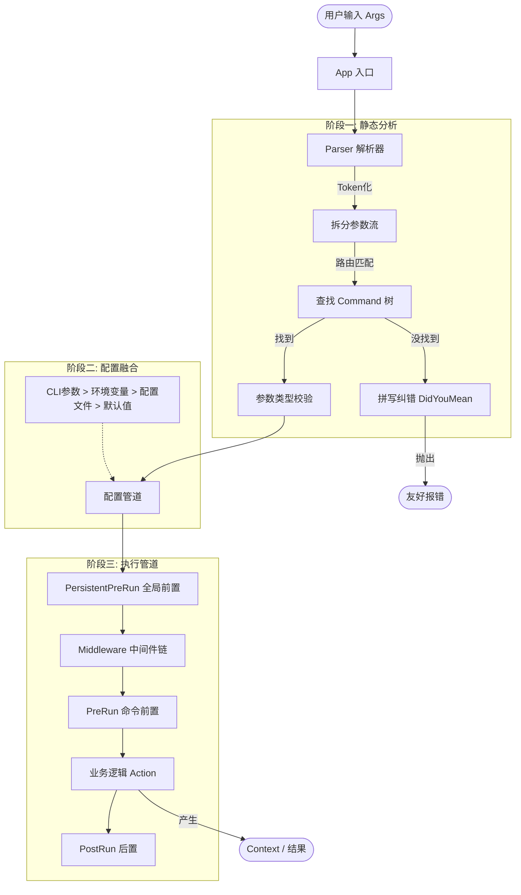

# 仓颉 CLI 框架源码深度漫游指南

本文档旨在为开发者（即便是初学者）提供一份详尽的指南，帮助你理解本 CLI 框架的设计思想、核心架构以及具体实现细节。

---

## 1. 设计哲学：不仅是解析器，而是应用容器

大多数简单的 CLI 库只负责“解析参数”（把 `--port 8080` 变成 `int port = 8080`）。但本框架的设计目标是对标 `Rust` 生态中的现代化工具，它是一个**应用容器**。

### 核心概念
1.  **一切皆命令 (Everything is a Command)**：无论是根程序（如 `git`）还是子功能（如 `clone`），在代码中都是 `Command` 类的实例。
2.  **声明式构建 (Declarative Builder)**：你不需要写 `if/else` 来判断逻辑，而是通过链式调用（`.command().flag().action()`）来描述你的程序长什么样。
3.  **上下文流转 (Context Flow)**：数据（参数、配置、状态）被打包在一个 `Context` 对象中，在整个生命周期中流动。

---

## 2. 核心架构与生命周期

当一行命令（如 `tool server start --port 8080`）输入时，框架内部发生了一系列精密的运转。

---

## 3. 源码地图：我去哪里看什么？

`src/` 目录下的文件各司其职。以下是阅读源码的最佳顺序：

### 第一层：骨架与皮肤 (API 层)
*   **`app.cj`**: **入口**。这是整个框架的大管家。它负责初始化环境、加载配置、捕获信号，并启动解析流程。
*   **`command.cj`**: **核心数据结构**。定义了什么是命令。你可以看到 `_subcommands`（子命令映射表）、`_flags`（选项列表）以及 `_action`（具体执行的函数）。
*   **`flag.cj` / `argument.cj`**: **参数定义**。定义了选项的长短名、默认值、类型转换逻辑。

### 第二层：大脑 (逻辑层)
*   **`parser.cj`**: **解析引擎**。这里有最复杂的逻辑。它负责遍历字符串数组，识别哪个是命令，哪个是 Flag，哪个是 Value，并处理 `--key=value` 或 `-v` 这种变体。
*   **`context.cj`**: **数据容器**。这是用户在 Action 中拿到的对象。它提供 `fs` (文件系统)、`env` (环境变量)、`args` (参数) 的访问接口。这也是实现 `mockRun` 测试的核心——我们只要伪造一个 Context，就能欺骗 Action。

### 第三层：辅助系统 (基础设施)
*   **`config.cj`**: **配置加载**。实现了 TOML/KV 解析，以及从文件系统递归查找配置文件（如 `.config.toml`）的逻辑。
*   **`diagnostic.cj`**: **医生**。负责所有的报错。它不直接 `print` 错误，而是渲染带有颜色、建议和错误码的结构化文本。
*   **`locale.cj`**: **翻译官**。负责国际化（i18n），将框架提示语翻译成不同语言。
*   **`widget.cj`**: **UI 组件**。包含进度条、加载动画、选择框的实现。

---

## 4. 关键实现原理解析

### 4.1 怎么把字符串变成强类型数据？ (Flag Parsing)
在 `flag.cj` 中，你会看到 `ValueConverter` 接口。
框架不只是存储字符串。当你定义 `.flag(Flag("port", type: Int64))` 时：
1. `Tokenizer` 提取字符串 `"8080"`。
2. `Parser` 找到对应的 Flag 定义。
3. `Parser` 调用内置的转换器 `Int64.parse("8080")`。
4. 如果失败，抛出 `TypeConversionException`，被 `App` 捕获并打印友好的错误。

### 4.2 配置优先级是如何实现的？ (The Config Pipeline)
在 `command.cj` 或 `flag.cj` 获取值时，并不是直接读取。逻辑如下：
1. **Check CLI**: 用户在命令行输入了吗？有则返回。
2. **Check Env**: 定义过 `envPrefix` 吗？去环境变量找 `APP_PORT`。
3. **Check ConfigFile**: 加载了 `config.toml` 吗？去 Map 里找 `port`。
4. **Return Default**: 都没有？返回代码里写的默认值。

### 4.3 为什么测试不需要启动真实进程？ (MockRun)
这是一个巨大的工程亮点。
通常 CLI 很难测试，因为要捕获 `stdout` 很麻烦。
本框架在 `context.cj` 中抽象了 `Console` 接口。
*   **真实运行**: `Context` 绑定真实的 `std.console`。
*   **测试运行 (`mockRun`)**: `Context` 绑定一个 `StringBuffer`。
这样，你的测试代码 `ctx.console.println("hello")` 实际上是写入了内存中的字符串，测试框架随后读取这个字符串进行断言。

---

## 5. 如何扩展框架？

### 如果你想添加新的 UI 组件
去 `src/widget.cj`。继承 `Widget` 抽象类，实现 `render()` 方法。记得处理 ANSI 转义码（控制颜色和光标）。

### 如果你想改进错误提示
去 `src/diagnostic.cj`。你可以修改 `DiagnosticRenderer` 来调整错误信息的排版格式。

### 如果你想支持特定语言的翻译
去 `src/locale.cj`。实现 `Locale` 接口，并在 `test/locale_test.cj` 中添加对应的测试用例。

---

## 6. 写给初学者的建议

1.  **从 `examples/` 或是 `src/test/integration_test.cj` 看起**。先看“怎么用”，再看“怎么实现”。
2.  **断点调试 `Parser.parse()`**。这是最复杂也是最精彩的部分，看它如何“吃掉”参数流。
3.  **关注 `Context` 的传递**。理解了 Context 如何在中间件和 Action 之间传递，你就理解了框架的血脉。
